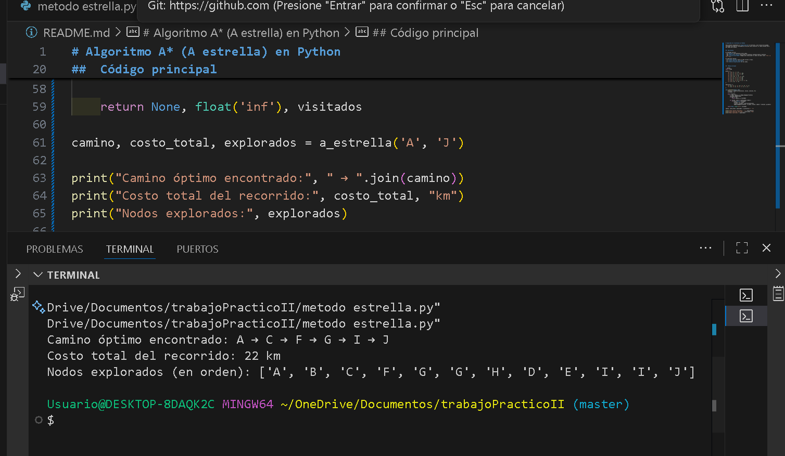

# Algoritmo A* (A estrella) en Python

Este proyecto implementa el **algoritmo A*** (A estrella), una técnica de búsqueda informada utilizada en inteligencia artificial para encontrar el camino óptimo entre dos nodos de un grafo.


##  Descripción

El programa utiliza:
- Un **grafo** con distancias entre nodos.
- Una **heurística (h(n))** que estima la distancia restante hasta el destino.
- Una **cola de prioridad** (heapq) para seleccionar el nodo con menor costo `f(n) = g(n) + h(n)`.

El algoritmo retorna:
- El **camino óptimo** entre el nodo inicial y final.
- El **costo total del recorrido**.
- El **orden de exploración** de los nodos.


##  Código principal

```python
import heapq

grafo = {
    'A': {'B': 4, 'C': 3},
    'B': {'A': 4, 'D': 5, 'E': 10},
    'C': {'A': 3, 'F': 4, 'G': 8},
    'D': {'B': 5, 'H': 7},
    'E': {'B': 10, 'I': 6, 'J': 15},
    'F': {'C': 4, 'G': 2, 'H': 6},
    'G': {'C': 8, 'F': 2, 'I': 9},
    'H': {'D': 7, 'F': 6, 'I': 5},
    'I': {'H': 5, 'G': 9, 'E': 6, 'J': 4},
    'J': {'E': 15, 'I': 4}
}

heuristica = {
    'A': 20, 'B': 3, 'C': 15, 'D': 12, 'E': 8,
    'F': 10, 'G': 9, 'H': 7, 'I': 4, 'J': 0
}

def a_estrella(inicio, fin):
    frontera = [(heuristica[inicio], inicio, [inicio], 0)]
    visitados = []

    while frontera:
        f, nodo, camino, g = heapq.heappop(frontera)
        visitados.append(nodo)
        if nodo == fin:
            return camino, g, visitados

        for vecino, costo in grafo[nodo].items():
            if vecino not in visitados:
                g_nuevo = g + costo
                f_nuevo = g_nuevo + heuristica[vecino]
                heapq.heappush(frontera, (f_nuevo, vecino, camino + [vecino], g_nuevo))

    return None, float('inf'), visitados

camino, costo_total, explorados = a_estrella('A', 'J')

print("Camino óptimo encontrado:", " → ".join(camino))
print("Costo total del recorrido:", costo_total, "km")
print("Nodos explorados:", explorados)


##  Capturas del proyecto

### Ejecución del programa



## Tecnologías utilizadas
Lenguaje: **Python 3**
Herramienta de control de versiones: **Git y GitHub**
Editor de código: **Visual Studio Code**


##  Conclusiones personales
Durante el desarrollo de este trabajo aprendí a usar Git y GitHub para el control de versiones, realizando commits, push y creando repositorios remotos.  
También reforcé la lógica del algoritmo A* y la importancia de documentar correctamente el proyecto con un archivo README.md.  
Esta experiencia me ayudó a entender cómo se gestionan proyectos reales y cómo compartir código de forma profesional.


